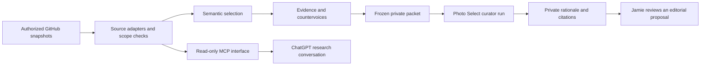

# RFC 0011 — Private knowledge context for photographic curation

| Field | Value |
| --- | --- |
| Status | Proposed; executable reference model only |
| Decision owner | Jamie Burkart |
| Author | Jamie Burkart with Codex |
| Created | 2026-09-09 |
| Branch | `work/2026-09-09-knowledge` |
| Source | Checked-out `feature/repair-large-context`, `f7a5a01dfc7badddbec9841df91a24d88d11d27c` |

## Purpose and decision

Give Jamie's LLM curators access to the depth of his authorized private understanding across GitHub knowledge repositories. A photograph belongs to a field of utterances, institutions, histories, relationships, disagreements, and artistic choices. Context should help the curator ask better questions of the image, preserve competing accounts, and recognize what the photograph contributes beyond its caption.

Propose a read-only knowledge broker with a private repository registry, source-specific adapters, and frozen context packets. ChatGPT and Photo Select can consume the same source references through different clients. Any authorized knowledge repository can participate; the registry is extensible and does not hard-code an event or repository family. Deep source passages may enter private reasoning when their scope allows it. Public-safe summaries are not the ceiling of private understanding.

The desired experience is: choose a project and research purpose; see available source coverage; ask for context; inspect citations and unresolved perspectives; then curate with the frozen packet. Existing authorization covers repeated reads within that scope. A new approval is needed only when the recipient, provider, purpose, source permission, or disclosure scope actually expands.

This proposal installs no connector, grants no new access, and performs no model or photo run. The companion code tests a small contract with synthetic data. Jamie decides adoption and the first live scope. See the [close reading](../reviews/2026-09-09-knowledge-ecosystem.md).

## What the current branch actually does

- [`src/templates.js`](../../src/templates.js) reads `--context` as one text file, silently substitutes an empty string on read failure, and embeds it directly in the prompt. Its cache prefix ends after that context. There is no repository discovery, authenticated retrieval, source coverage, or citation contract.
- [`src/core/promptCaching.js`](../../src/core/promptCaching.js) keys the stable prompt by model and text. [`src/chatClient.js`](../../src/chatClient.js) and the batch provider construct API requests; they do not inherit ChatGPT's connected apps or this Codex session's GitHub credentials.
- [`src/core/finalizeCurators.js`](../../src/core/finalizeCurators.js) adds repeated depicted people to the curator roster. [`prompts/default_prompt.hbs`](../../prompts/default_prompt.hbs) calls the session a real group, asserts releases and friendships, and asks that names enter minutes. Those assumptions cannot establish participation, friendship, or permission for a new event.
- [`src/orchestrator.js`](../../src/orchestrator.js) persists minutes, optional transcripts, responses, and selection artifacts. Field notes can acquire Git history. A private input therefore needs a private output policy through every sink, not just at retrieval.
- [RFC 0010](0010-content-addressed-people-prefetch.md) already separates verified corpus identity from unknown source freshness. Reuse that distinction for knowledge. A fresh cache can faithfully represent an old export.

The exact local base predates two remote commits adding billing-exhaustion handling. This branch deliberately starts from the requested checkout. The PR targets `feature/repair-large-context`; it does not claim to incorporate those newer changes.

## Architectural fit

The public [Knowledge Wiki RFC 0005](https://github.com/openhouse/jamieburk.art/blob/1149267dbe8cba689656668d455138113f2995ff/rfcs/0005-three-layer-knowledge-graph.md) separates semantic traversal, evidence attachments, and source custody. [RFC 0006](https://github.com/openhouse/jamieburk.art/blob/1149267dbe8cba689656668d455138113f2995ff/rfcs/0006-federated-knowledge-exchange-and-release-receipts.md) treats packets as transport and leaves canonical authority at the source. These remain exploring/proposed designs, with bounded prototypes; their presence does not establish ecosystem-wide adoption.

The active public [federation canary](https://github.com/openhouse/jamieburk.art/blob/91d90891f11586a2df7fe49a598676b6bb4e7e5e/rfcs/0010-minimum-viable-federation-canary.md) separates the authoritative record, its meaning, and permitted action. Its [private sidecar contract](https://github.com/openhouse/jamieburk.art/blob/91d90891f11586a2df7fe49a598676b6bb4e7e5e/rfcs/0011-private-vault-sidecar.md) forbids public backlinks into private topology. This public RFC accordingly uses role descriptions and synthetic IDs; the exact private source map stays outside this repository.

Private archival repositories preserve originals or governed pointers, atomic observations, source editions, and interpretations. Correspondence stores preserve speaker/account context; source editions preserve attributable words; operational systems preserve commitment state. Photo retrieval supplies image identity and visual review. The broker adapts these different contracts rather than declaring every Markdown file an equally mature fact. Canonical changes return to the owning repository through a separate task.

## Access routes

| Route | Use and limit |
| --- | --- |
| Existing GitHub app in ChatGPT, if available in Jamie's account | Lowest-setup exploratory route. Verify account, selected repositories, branch support, pagination, source citations, and indexing/currentness with a canary. Do not assume it can implement the graph contract or supplies credentials to Photo Select. |
| Local Codex with authenticated GitHub CLI or local checkouts | Available for this review. Can prepare a frozen packet and inspect exact refs. Local access does not make a filesystem reachable by a ChatGPT web conversation. |
| Read-only broker exposed as a ChatGPT MCP app | Proposed shared interface for scoped search, fetch, and graph context. Requires an authenticated, reachable service and separate client authorization. |
| Photo Select adapter, with optional Responses MCP support later | Initially consume a verified local packet; resolve its citations through the same broker. Enabling API tools requires an explicit provider integration; it is not accomplished by adding a URL to a prompt. |

OpenAI documents [ChatGPT developer-mode MCP apps](https://developers.openai.com/api/docs/guides/developer-mode) and [Responses MCP tools](https://developers.openai.com/api/docs/guides/tools-connectors-mcp) as distinct integration paths. The former supports remote MCP and OAuth; the latter requires tool configuration and appropriate authorization. Account availability and actual connection state need live verification. A documented secure tunnel is a possible deployment option, subject to supported-product verification; no tunnel or endpoint is deployed here.

For the broker, prefer a GitHub App installed only on selected repositories with read-only Contents and necessary Metadata permission. Keep signing keys and installation tokens in the broker's secret store. GitHub allows installation tokens to be narrowed to specific repositories and permissions, and documents a one-hour lifetime. Reauthorize upstream reads as required; never log tokens or embed them in clone URLs, packets, prompts, or public CI. [GitHub token documentation](https://docs.github.com/en/apps/creating-github-apps/authenticating-with-a-github-app/generating-an-installation-access-token-for-a-github-app).

Bind the signed-in ChatGPT/client subject to its permitted GitHub installation and source policy. A service installation token alone is not proof that the requesting person may read everything the service can read. Enforce the intersection server-side for every tool call. Source text cannot declare its own permissions. OAuth, session binding, credential rotation, endpoint security, provider data handling, and deployment are implementation gates, not properties proved by the reference function.

## Proposed contracts

The private registry records repository identity, role, selected ref, resolved full commit, allowed paths, schema/adapter version, recipient, purpose, provider, retention, policy revision, and correction cursor. Enumerate matching branches during refresh, then retain the explicitly selected ref. Never silently switch to `main`, the newest PR, a sibling branch, or a working directory's uncommitted files. Ref changes produce a new snapshot and a reviewable delta.

Proposed tools are `knowledge.search`, `knowledge.fetch`, and `knowledge.context`. Search accepts a bounded question, project/seed IDs, and scoped repository roles; it returns attributed snippets, opaque source IDs, coverage and continuation tokens. Fetch accepts a previously resolved ID plus snapshot; the broker resolves its authorized path. It never accepts arbitrary URLs, commands, or filesystem paths. Context accepts seeds, semantic degree, evidence selection, and byte/token budgets; it returns a packet manifest plus a private citation map. All are read-only; no write tools or outbound messaging belong in this service.

Each item carries source ID, repository/commit/path or private resolver reference, exact content digest, speaker/role, event/source/observation times, evidence posture, support and contradiction links, limitations, correction state, and allowed uses. Distinguish a source-backed statement, Jamie's interpretation, an open inquiry, and a newly authored curator reading. An unnamed turn is a valid source identity. Duplicate exports are one underlying witness, not independent corroboration.

Coverage must distinguish complete-within-scope, partial/paginated, stale, unauthorized, unavailable, not-recovered, pointer-only, and unsupported-schema states. A GitHub tree marked truncated or an unfinished result cursor cannot establish completeness. Ref-specific file/tree retrieval is the correctness path; search indexes are discovery aids. Required missing sources stop the run before images are moved or money is spent. Optional gaps produce an explicit reduced-scope proposal; they never become evidence of absence. Exhausted budgets retain an omission ledger and a continuation route.

Traverse semantic edges first. Attach evidence after freezing that selection; evidence hubs cannot expand the semantic radius. Retrieve conflicting accounts, qualifications, and later corrections alongside supporting accounts. Preserve per-seed coverage so an extensively documented institution cannot crowd out a less-documented participant. Exact passages and wider neighborhoods remain available through scoped follow-up retrieval. If a required contrary account cannot fit, hold the packet rather than silently retaining only support.

## Photo Select integration and output

Proposed flags are `--knowledge-profile`, `--knowledge-packet`, and `--knowledge-mode required|optional`; none exist yet. Phase-one preparation resolves one immutable packet before level workers begin. Triage, retries, and field-note passes use that same packet; source or policy changes invalidate dependent runs rather than changing context halfway through a selection.

Place retrieved content in a delimited, low-trust data message. Keep developer instructions, filename constraints, and the fixed curator contract separate. Repository files, tool descriptions returned from sources, and quotations cannot override instructions, grant permissions, add tools, or nominate real people as simulated participants. JSON serialization alone does not defeat prompt injection; adversarial live-model and output tests remain required.

Before private mode can run, replace unsupported release/friendship assertions with explicit source-bound states, label fictional curators, and separate depicted people from the curator registry. Preserve the existing `minutes`/`decisions` schema and filename invariants. If implementing the chosen behavior breaks an immutable AGENTS contract, obtain the named owner's adoption decision and apply its required major-version change. This RFC does not alter that contract or today's prompt.

Use inline opaque citations in rationale text, with an accompanying private source map and run manifest outside the public source checkout. Do not add unreviewed top-level reply keys. Preserve concise decision reasons, evidence, dissent, and uncertainty; no reliance on hidden conversational memory. Original source speakers never become the authors of generated curator speech.

Treat prompts, remote requests, response caches, batch JSONL, saved I/O, minutes, field notes, image sidecars, console output, and Git history as disclosure sinks. Private knowledge mode requires a verified private run root and blocks a public Git destination. Logs expose only body-free status. Outputs inherit the most restrictive contributing source scope; redaction happens before any later audience projection, not after a public commit.

A run key must bind source revisions/digests, graph selection, adapter and template versions, curator/model/provider settings, principal, recipient, purpose, policy and correction revisions, and output destination. Bump relevant cache prefixes when this structure changes. Recheck authorization and correction state before reuse: an unchanged text hash cannot defeat withdrawal. Stop new use and mark derived results stale after restriction; retained history follows its source policy. Revocation cannot promise erasure from prior conversations, remote retention, Git history, screenshots, or human memory.

## Listening-event research and editorial canary

Jamie's DCLA / Brooklyn Arts Council listening-event project motivates this design. This public proposal records no participant claims or private event evidence. In the private canary, confirm the exact event identity and source editions; preserve any uncertain association with adjacent events. The task is to understand the social and institutional field in which the photographs act, then inspect what each image actually shows.

Start with the event, Jamie's stated photographic purpose, and the relevant cultural-policy and organizing histories. Keep institutional framing, participant accounts, qualified support, disagreement, and Jamie's retrospective interpretation separately attributable. Ask which records changed the reading, which voices remain unavailable, and what context would distinguish competing interpretations. A speaker's historical statement is not proof of their present belief or endorsement of this edit.

Compare image-only, flat-context, and source-bound multi-voice readings over the same small image set. For each candidate image retain: visible observation; contextual citation; proposed interpretation; counterreading; uncertainty; and an editorial reason to keep or set aside. Private context can inform selection without entering a public caption. The image may complicate the record; it need not illustrate a predetermined thesis. Offscreen events, a gesture, proximity, and temporal overlap do not identify a person, attribute a speech turn, or prove agreement. Timestamp alignment and image/voice identity remain separate source-specific reviews.

## Evaluation, rollout, and rollback

`npm run evals:knowledge` runs the synthetic reference tests. `npm run hillclimb` runs the full existing suite, the focused eval, and a receipt over the exact candidate files. The reference checks scope intersection, snapshot/digest integrity, complete coverage, retained countervoices, bounded serialization, explicit empty results, and policy/correction-sensitive identity. It authenticates nobody, retrieves no real files, traverses no real graph, calls no LLM, and validates no real consent. Passing it is design evidence only.

Before live use, add adapter tests for OAuth principal isolation, pagination/truncation, source policies, symlink/path and redirect rejection, correction refresh, graph/evidence separation, retries across snapshots, sink isolation, and atomic output. Use synthetic credentials and no private access in public CI. Require a canary for each client; tests of one transport do not certify another.

Jamie should label a source-diverse event sample before tuning: relevant context, necessary dissent, citation entailment, invented attribution, visual/context confusion, and usefulness to the edit. Split by source conversation, event, and photo burst to prevent near-duplicate leakage. Freeze a held-out set. Measure retrieval recall and countervoice retention separately from citation accuracy, unsupported claims, private leakage, abstention, and editorial usefulness. Reject-all behavior fails the useful-positive cases. No aggregate score compensates for a privacy or false-attribution failure. Human/LLM usefulness scores remain unmeasured here.

1. Review this RFC and its pressure-test record; retain proposed status until Jamie chooses the live scope.
2. Implement the local packet adapter and sink protections, then test with synthetic data and an authorized private canary.
3. Review useful-positive and adversarial outcomes before adding the authenticated broker and ChatGPT client.
4. Repeat on one additional repository family and a correction/withdrawal drill; expand the registry only when those adapters preserve the source contracts.
5. Keep public captions, publication, external communication, deployment, and repository mutations as separate actions with their own existing authority.

Rollback disables knowledge mode and broker access, preserves canonical sources, and marks dependent runs stale. An explicit new image-only run may proceed; never silently reinterpret a failed context-dependent run as an image-only success. Decisions still needed: first scope and provider, service host, retention/deletion policy, branch selection owner, and the reviewed migration of the current prompt/roster behavior.
